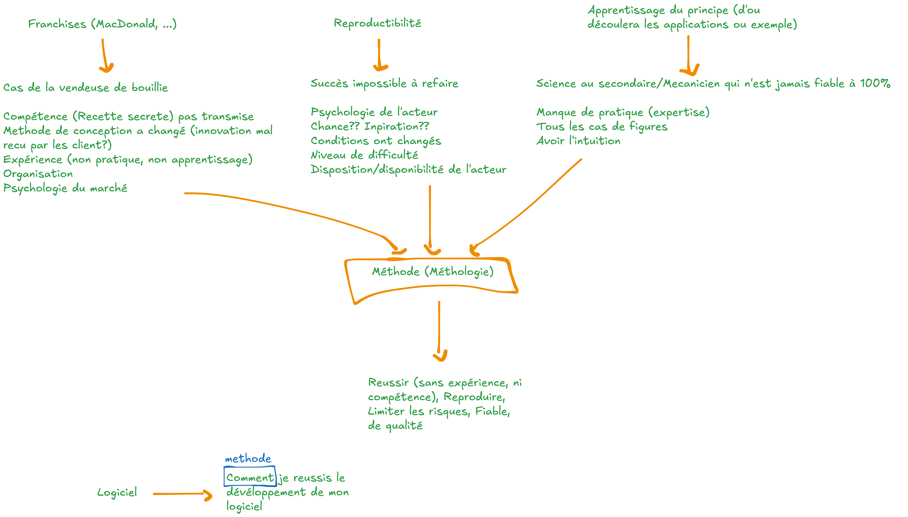

.. _part1_chap0:

***********************************************************************
Chapitre 0 : Introduction à la méthodologie
***********************************************************************

Avant de parler de *développement de logiciel*, prenons du recul : qu'est-ce
qu'une **méthode** (ou **méthodologie**), et pourquoi est-elle si importante —
dans la vie de tous les jours comme en ingénierie ?

Une **méthode** est un **processus, étape par étape**, qui décrit comment
atteindre un objectif de façon **fiable** et **reproductible**.

Objectifs
=========

À la fin de ce chapitre, vous devez pouvoir :

- Définir ce qu'est une méthode / une méthodologie
- Illustrer, par des exemples du quotidien, *pourquoi* une méthode est nécessaire
- Comprendre que le développement d'un logiciel est complexe — d'où le caractère **critique** d'une méthodologie

Exercice introductif
====================

1. Pensez à une réussite que vous n'avez jamais su reproduire. Pourquoi, selon vous ?
2. Connaissez-vous une « recette » (au sens large) qui marche *à tous les coups* ? Qu'est-ce qui la rend si fiable ?
3. Pourquoi deux personnes, partant du même objectif, arrivent-elles parfois à des résultats très différents ?

Pourquoi une méthodologie ?
===========================

   Trois situations du quotidien mènent toutes à la même conclusion : il faut une **méthode**.

Trois exemples convergent vers la même idée.

1. Les franchises (McDonald's, …)
---------------------------------

Les grandes franchises (McDonald's, Quick, Burger King, …) reposent sur une
**méthode reproduite partout** — « la recette magique ». D'où un gain énorme.

Le contre-exemple : *le cas de la vendeuse de bouillie*. Tant que la compétence
(la « recette secrète ») n'est **pas transmise** comme une méthode, tout s'écroule
dès que :

- la **compétence** n'est pas transmissible ;
- la **méthode de conception** change (une innovation mal reçue par les clients) ;
- l'**expérience** reste tacite (non mise en pratique, non apprise) ;
- l'**organisation** et la **psychologie du marché** ne sont pas prises en compte.

2. La reproductibilité
----------------------

Réussir une fois ne sert à rien si le **succès est impossible à refaire**. Sans
méthode, le résultat dépend de facteurs incontrôlés :

- la **psychologie** et la **disponibilité** de l'acteur ;
- la **chance** ou l'**inspiration** ;
- des **conditions qui ont changé** ;
- le **niveau de difficulté** rencontré.

Une méthode rend le succès **reproductible**, indépendamment de ces aléas.

3. L'apprentissage du principe
------------------------------

Une bonne méthode capture un **principe** général, d'où découlent ensuite les
applications et les exemples. À l'inverse, sans principe :

- on manque de **pratique** et d'**expertise** ;
- on ne couvre pas **tous les cas de figure** ;
- on dépend de son seul « **flair** » / intuition.

C'est le maçon (ou l'élève du secondaire) « qui n'est jamais fiable à 100 % » :
faute d'avoir appris le principe, il ne peut pas garantir le résultat.

Ce qu'apporte une méthode
=========================

Dans les trois cas, la **méthode (méthodologie)** permet de :

- **réussir** même sans expérience ni compétence préalable ;
- **reproduire** le résultat ;
- **limiter les risques** ;
- obtenir quelque chose de **fiable** et **de qualité**.

Et le logiciel dans tout ça ?
=============================

Développer un logiciel est une activité **complexe** : beaucoup d'étapes, de cas
à prévoir, d'acteurs à coordonner, et des erreurs qui peuvent coûter très cher
(l'explosion d'**Ariane 5** en 1996, due à une erreur logicielle, en est un
exemple célèbre).

.. admonition:: À retenir
   :class: important

   Plus une activité est **complexe**, plus disposer d'une **méthode** pour la
   mener devient **critique**. C'est précisément le cas du développement
   logiciel — et c'est tout l'objet de ce cours.

   *Logiciel + méthode → « Comment je réussis le développement de mon logiciel. »*

La suite du cours répond à ce « comment » : les :doc:`fondamentaux <chap1>`
(qu'est-ce qu'un logiciel, son :doc:`cycle de vie <chap2>`, sa
:doc:`documentation <chap3>`), puis les :doc:`méthodes de développement
<../part2/index>` proprement dites.

Pour aller plus loin
====================

Pour approfondir la notion de méthodologie, vous pouvez consulter cette
`playlist vidéo sur la méthodologie
<https://www.youtube.com/watch?v=dAUZO34xJKs&list=PLIQzeStLZINk>`_.

.. raw:: html

   

     <iframe src="https://www.youtube.com/embed/dAUZO34xJKs?list=PLIQzeStLZINk"
             style="position: absolute; top: 0; left: 0; width: 100%; height: 100%; border: 0;"
             title="Méthodologie — vidéo"
             allow="accelerometer; autoplay; clipboard-write; encrypted-media; gyroscope; picture-in-picture"
             allowfullscreen></iframe>
   

