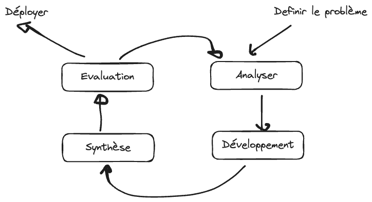
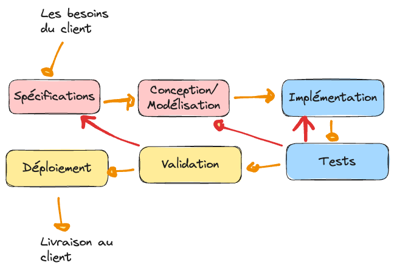

.. _part1_chap1:

****************************************************************************
Chapitre 1 : Introduction à la méthodologie de développement de logiciel
****************************************************************************

*SDLC = Software Development Life Cycle* ⇒ le **cycle de vie de développement
d'un logiciel**. Une **méthodologie** répond à la question : *comment développer
efficacement un logiciel ?*

.. note::
   Le :doc:`chapitre 0 <chap0>` a montré *pourquoi* une méthode est nécessaire en
   général. Ce chapitre pose les bases propres au **logiciel**.

Objectifs
=========

À la fin de ce chapitre, vous devez pouvoir :

- Définir ce qu'est un logiciel et le distinguer des notions voisines
- Citer les grandes familles de logiciels
- Caractériser un bon logiciel et un logiciel de qualité
- Expliquer pourquoi suivre une méthodologie est important

Exercice introductif
=====================

1. Selon vous, qu'est-ce qu'un *logiciel* ? En quoi diffère-t-il d'un *programme* ou d'une *application* ?
2. Qu'est-ce qui fait, à vos yeux, un *bon* logiciel ?
3. Avez-vous déjà développé quelque chose que vous n'avez pas su refaire ou expliquer ensuite ? Pourquoi ?
4. Pourquoi suivre une méthode plutôt que de « coder directement » ?

1. Qu'est-ce qu'un logiciel ?
=============================

Un logiciel est un (ensemble de) programme(s)/procédure(s) — c'est-à-dire une
**suite ordonnée d'instructions** (un algorithme) — capable de :

- faire fonctionner un système (ordinateur ou appareil électronique) ;
- régler un problème ou accomplir des tâches spécifiques (traitement de données) ;
- automatiser des tâches.

.. note::
   **Logiciel = une suite d'instructions pour dire à l'ordinateur (ou à la
   machine) quoi faire.**

De façon générale, on peut considérer que **Logiciel = Programme = Application**.
Mais il existe quelques spécificités utiles à distinguer :

.. list-table::
   :header-rows: 1
   :widths: 16 28 28 28

   * - Terme
     - Définition
     - Différence clé
     - Exemple
   * - **Algorithme**
     - Une suite d'instructions décrivant la résolution d'un problème
     - Indépendant d'un ordinateur / d'une machine
     - Comment résoudre une équation du second degré
   * - **Programme**
     - Une suite d'instructions exécutable sur un ordinateur
     - Réalise une tâche spécifique
     - L'écrire dans un langage (ex. Python)
   * - **Application**
     - Programme ou logiciel doté d'une interface graphique
     - Ajoute une IHM
     - Un formulaire saisissant *a*, *b*, *c* et un bouton « Résoudre »
   * - **Logiciel**
     - Un ensemble de programmes
     - Effectue plusieurs tâches qui concourent à résoudre un/des problème(s) ; cycles Dev → Beta → Release
     - Résoudre plusieurs équations et inéquations
   * - **Progiciel**
     - Plusieurs logiciels réunis pour la gestion (comptabilité, finance, RH… → ERP)
     - Suite intégrée
     - Une suite de gestion d'un cursus universitaire (algèbre, géométrie, physique…)

1.1. Typologie des logiciels
----------------------------

On distingue trois grandes familles :

.. list-table::
   :header-rows: 1
   :widths: 33 33 34

   * - Système d'exploitation
     - Logiciel machine (drivers)
     - Logiciel d'utilité
   * - Windows, Linux, macOS, Android, FreeRTOS
     - Arduino, logiciels embarqués sur des équipements électroniques
     - Tout le reste (desktop, web, mobile) — Word, Excel, Photoshop, Facebook, …

2. Qu'est-ce qu'un *bon* logiciel ?
===================================

Un bon logiciel :

- respecte le **cahier des charges** ;
- satisfait des **critères de qualité** : assez rapide, fiable (digne de confiance, sans bugs), …

On part de la notion de **bon algorithme** :

.. admonition:: Bon algorithme
   :class: tip

   **Correctness** (il fait ce qu'on lui demande)
   + **Completeness** (il prend en compte tous les cas)
   + **Efficiency** (**rapidité** = temps d'exécution, **stockage** = mémoire utilisée).

.. note::
   **Bon logiciel** = ensemble de bons algorithmes + **tests** (de validation et
   d'intégration).

   **Logiciel de qualité** = logiciel qui respecte des critères bien définis :
   fonctionnalité, performance, fiabilité, maintenabilité, utilisabilité,
   portabilité.

3. Les étapes de développement d'un logiciel
=============================================

Développer un logiciel, c'est avant tout **résoudre un problème** :

- **Décrire / identifier** le problème ;
- **Analyser** le problème (le décomposer, trouver les causes, envisager les solutions) ;
- **Résoudre** le problème (décider).

   Démarche générale de résolution de problème.

Toutes les méthodologies se baseront sur un **schéma standard** d'étapes, avec des
spécificités selon les problèmes et l'organisation du développement.

   Les étapes standard de développement d'un logiciel.

.. note::
   Toutes les méthodologies reprennent ce schéma standard, en l'organisant
   différemment selon les contraintes du projet. Ces étapes sont détaillées au
   :doc:`chapitre 2 <chap2>`.

3.1. Pourquoi suivre une méthodologie ?
---------------------------------------

Suivre une méthodologie permet de mieux résoudre le problème, d'avoir un suivi
assidu, de **gagner du temps et de l'argent**, d'être plus performant et de
garantir la **reproductibilité**. Les motivations générales (franchises,
reproductibilité, apprentissage du principe, Ariane 5) sont développées au
:doc:`chapitre 0 <chap0>`.

.. admonition:: À retenir
   :class: important

   Développer un bon logiciel — et être *sûr* qu'il est performant, correct,
   complet et efficace — passe par le suivi rigoureux d'un processus / d'une
   méthodologie.

Exercices
=========

.. note::
   À faire avant la prochaine séance.

1. Donnez, avec vos propres mots, une définition de : algorithme, programme, application, logiciel, progiciel. Illustrez chacun par un exemple différent de ceux du cours.
2. Citez trois critères de qualité d'un logiciel et proposez, pour chacun, une façon concrète de le mesurer.
3. Donnez un exemple (autre qu'Ariane 5) où l'absence de méthodologie a conduit (ou aurait pu conduire) à un échec.
