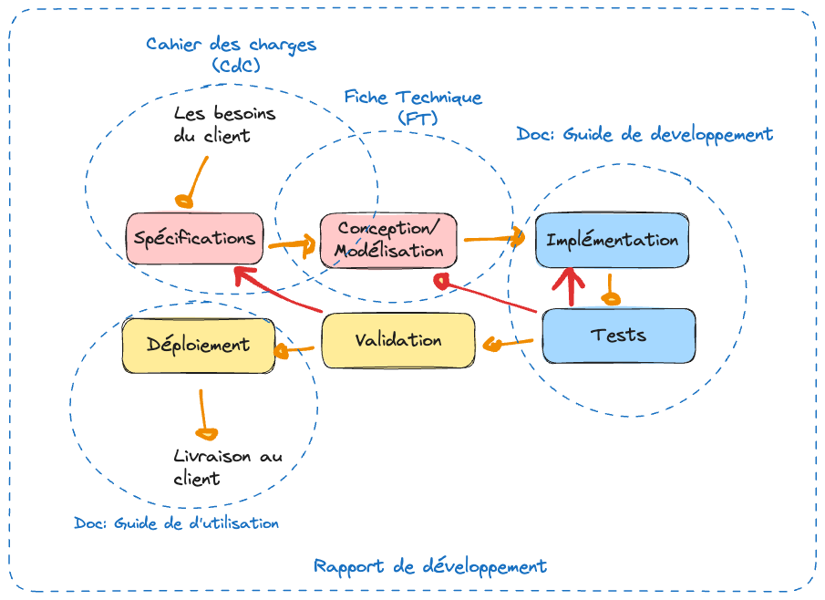
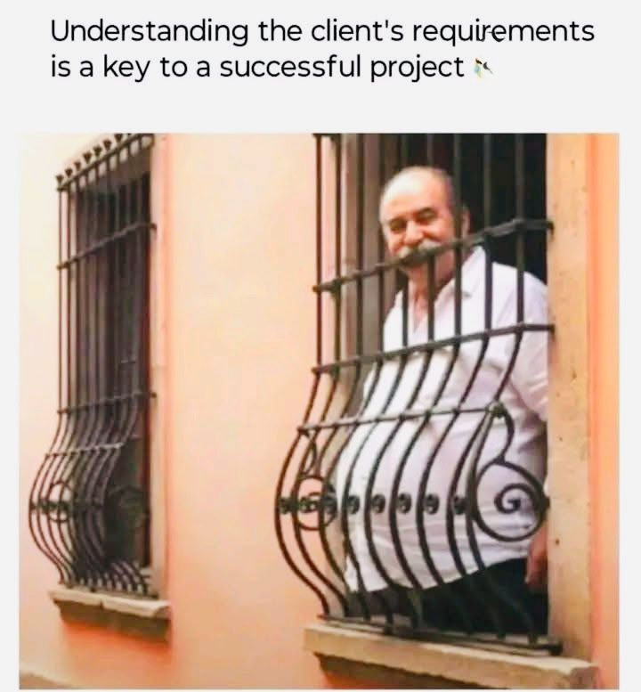

.. _part1_chap3:

***********************************************************************
Chapitre 3 : La documentation nécessaire
***********************************************************************

Un développement de logiciel s'accompagne de plusieurs documents. Chacun a un
rôle précis et un destinataire différent (client, équipe de développement,
utilisateur final).

Objectifs
=========

À la fin de ce chapitre, vous devez pouvoir :

- Citer les documents qui accompagnent un développement et leur rôle
- Rédiger la structure d'un **cahier des charges** (CDC)
- Rédiger une **fiche technique** (FT) permettant de réaliser le logiciel
- Distinguer clairement le rôle du CDC (avec le client) de celui de la FT (pour l'équipe)

Les documents du logiciel
==========================

.. list-table::
   :header-rows: 1
   :widths: 28 72

   * - Document
     - Rôle
   * - **Cahier des charges (CDC)**
     - Clarifie les besoins du client ; constitue le **contrat** réel qui lie le développeur au client.
   * - **Fiche technique (FT)**
     - Contient l'ensemble des éléments de modélisation traduisant les spécifications en un modèle de développement viable (souvent en UML, Merise).
   * - **Guide de développement**
     - Reprend les choix techniques : comment chaque module est testé, comment le code est structuré, le déploiement, …
   * - **Guide d'utilisation**
     - L'installation et l'utilisation : détaille les fonctionnalités à l'utilisateur, étape par étape.

   La documentation autour du développement d'un logiciel.

.. note::
   Le **rapport de développement** est souvent une *synthèse* de tous les
   documents du logiciel.

1. Le cahier des charges (CDC)
==============================

Le CDC est le document qui permet de **clarifier les besoins du client** et de
définir clairement les spécifications du problème, sur lesquelles on s'entendra
avec lui.

.. admonition:: Du besoin au CDC
   :class: tip

   Besoin du client → **Analyse** + poser des questions + consulter les archives
   + réunions de (re)cadrage → **Cahier des charges**.

   Bien comprendre le besoin réel du client est le point de départ.

1.1. Les parties du CDC (le cœur)
---------------------------------

1. **Objectif du projet** — définir clairement le projet : un titre, le contexte, les constats, une justification.
2. **Spécifications** — fonctionnelles (les fonctionnalités du système, avec exemples) et non fonctionnelles (sécurité, convivialité, ergonomie, …).

   .. warning::
      On peut mettre un petit diagramme de cas d'utilisation, mais ce n'est pas
      forcément recommandé : c'est souvent trop technique pour le client.

3. **Contraintes**

   - côté **client** : payer, mettre à disposition une salle, un serveur, les employés pour les enquêtes, … ;
   - côté **prestataire** : réaliser un logiciel qui répond aux besoins (avec la qualité attendue), finir à temps, livrer le produit.

4. **Livrables** — les énumérer clairement (avec un descriptif si nécessaire) ; cette partie peut servir de base au bon de livraison : préciser les droits cédés, le code, les documents, les rapports, …
5. **Chronogramme** — le délai de réalisation, avec date de début et de fin, accompagné d'un calendrier de réalisation (un **diagramme de Gantt**).

   .. figure:: img/gantt.png
      :alt: Exemple de diagramme de Gantt
      :align: center
      :width: 75%

      Un chronogramme de réalisation, sous forme de diagramme de Gantt.

6. **Signature**.
7. *(optionnel)* **Maquettes** — un ou deux *mock-ups* du logiciel, qui permettent aussi de discuter de la charte graphique.
8. *(optionnel)* **Budget / offre financière** :

   - ne jamais donner *juste* un montant : répartir l'offre en plusieurs modules, avec parfois des alternatives ;
   - si besoin, produire un document d'accompagnement (Excel) détaillant l'offre — *le diable est dans le détail*.

2. La fiche technique (FT)
==========================

La fiche technique reprend la modélisation du projet sous deux aspects :
l'**architecture générale** et la **conception détaillée**.

.. admonition:: Règle d'or
   :class: important

   Une fiche technique **DOIT** permettre la réalisation *complète* du logiciel
   sans que le développeur ait besoin de recontacter le client ou de consulter le
   cahier des charges.

Elle contient typiquement :

- **L'architecture générale** de développement : MVC, *design patterns*, paradigme, API et interactions, REST, …
- **Les diagrammes UML**, au minimum :

  - **Cas d'utilisation** (pour les fonctionnalités) ;
  - **Classe** (pour la gestion des données) ;
  - **Objet** (pour exemplifier les classes et méthodes) ;
  - **Séquence** (et/ou diagrammes d'état-transition) — au minimum un par cas d'utilisation.

- **Les spécifications et choix logiciels**.
- **Les maquettes** — au minimum une par cas d'utilisation.
- **La gestion des données et du contenu**.

Exercices
=========

.. note::
   Ces exercices préparent directement le **TP1 (CDC)** et le **TP2 (fiche
   technique)** — voir la :doc:`Partie 3 <../part3/index>`.

1. Pour le préliminaire (« logiciel de vente de produits avec recommandation »), rédigez l'**objectif du projet** et trois **spécifications fonctionnelles** + trois **non fonctionnelles**.
2. Proposez un **chronogramme** (Gantt) simplifié pour ce même projet.
3. Pour une fonctionnalité de votre choix, esquissez un diagramme de **cas d'utilisation** et un diagramme de **séquence**.
4. En quoi le cahier des charges et la fiche technique diffèrent-ils par leur **destinataire** et leur **objectif** ?
