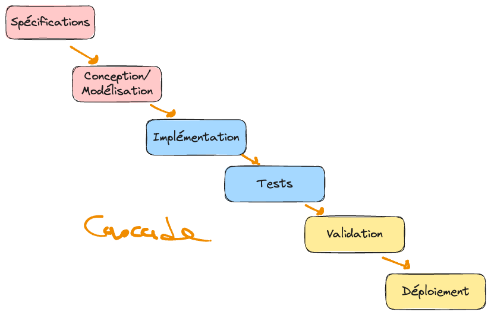
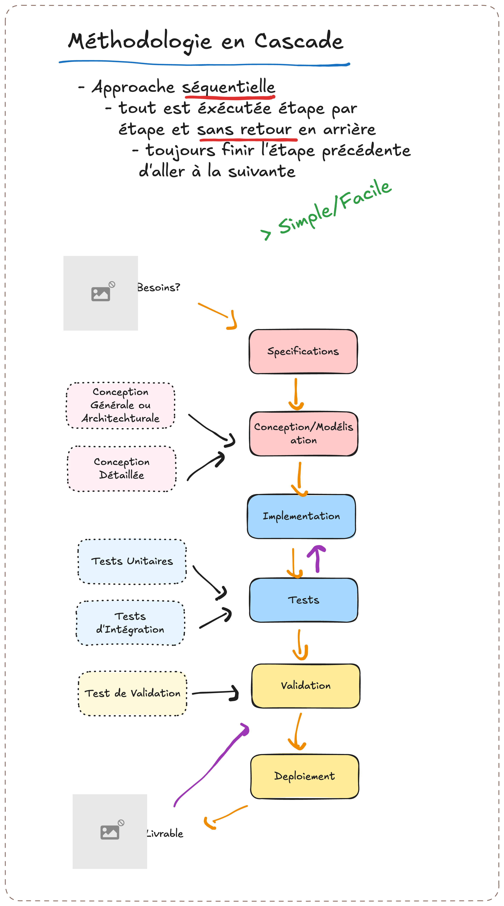

.. _part2_chap4:

***********************************************************************
Chapitre 4 : Le modèle en cascade
***********************************************************************

Dans le modèle en **cascade** (*waterfall*), tout se fait de façon
**séquentielle** : on finit une phase avant d'aborder la suivante, l'une après
l'autre.

Comment ça marche ?
===================

On enchaîne les phases, chacune devant être **terminée** avant de passer à la
suivante :

1. Identifier les **spécifications** (fonctionnelles et non fonctionnelles) ⇒ *finir ça* ;
2. **Conception** (générale : l'architecture logicielle ; détaillée : les diagrammes spécifiques) ⇒ *finir ça* ;
3. **Développer** l'outil (écrire le code) ⇒ *finir ça* ;
4. **Tester** le logiciel (tests unitaires, d'intégration, de validation) ⇒ *finir ça* ;
5. Aller vers le **client** pour s'entendre sur l'outil réalisé (utilisateurs réels, beta testing, tests d'IHM) ⇒ *finir ça* ;
6. **Déployer et livrer** ⇒ *finir ça*.

   Le modèle en cascade : les phases s'enchaînent sans retour en arrière.

   Détail des phases enchaînées dans le modèle en cascade.

Avantages, limites et usages
============================

.. list-table::
   :header-rows: 1
   :widths: 33 34 33

   * - Avantages
     - Limites / Défis
     - Bon pour
   * - Simple ; facile à mettre en œuvre ; suit un peu le fonctionnement humain
     - **Risqué** : une erreur faite tôt vous poursuit dans toutes les étapes suivantes ; on peut développer un outil qui ne correspond plus du tout au besoin
     - **Petits projets** ; sans contrainte forte de délai
   * -
     - **Défi** : le travail en séquence rend les **changements coûteux** (temps, ressources, coûts supplémentaires)
     - Projets à un seul module ; sites statiques (présentation d'entreprise, information)

.. admonition:: À retenir
   :class: important

   La cascade convient quand les **spécifications sont stables et bien connues**
   dès le départ, et que le projet est petit. Son talon d'Achille : l'absence de
   retour en arrière rend tout changement coûteux.

Exercice
========

Pour quel type de projet la cascade serait-elle un **mauvais** choix ? Justifiez à
l'aide de l'exemple préliminaire.
