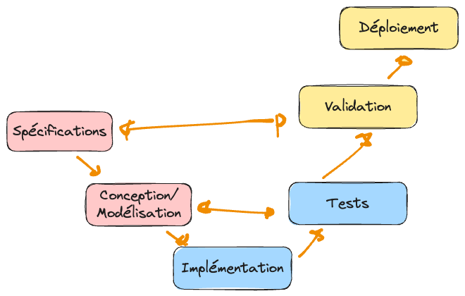
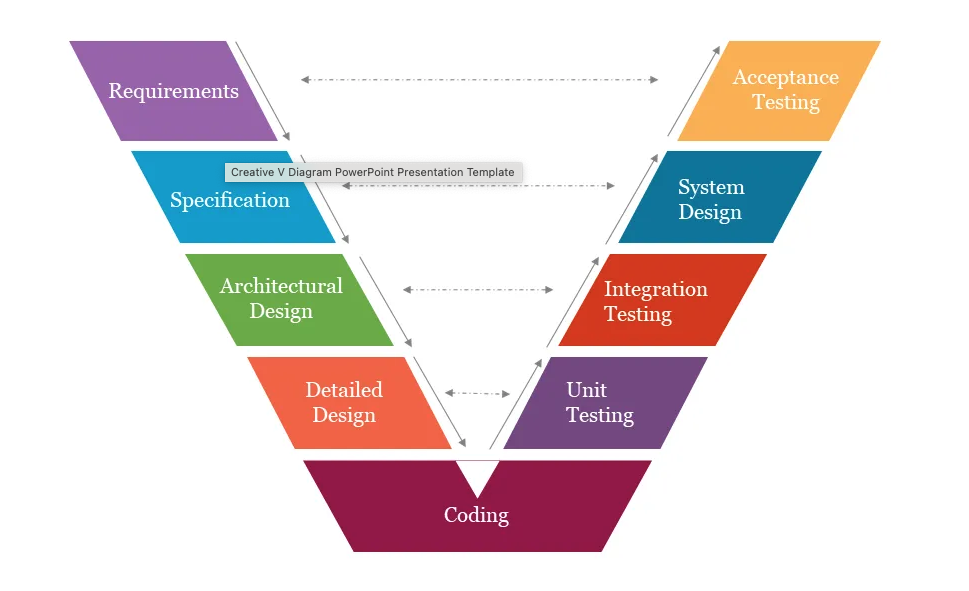
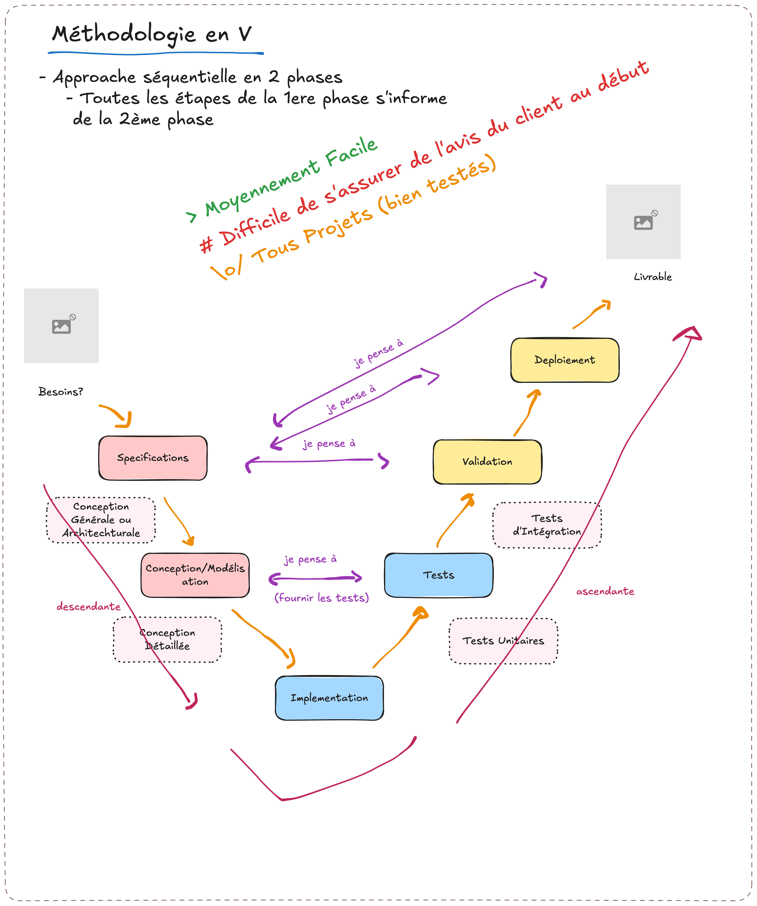

.. _part2_chap5:

***********************************************************************
Chapitre 5 : Le modèle en V
***********************************************************************

Le modèle en **V** se lit en deux parties, comme son nom l'indique : une **phase
descendante** (jusqu'à l'implémentation) et une **phase ascendante** (jusqu'au
déploiement). Il vient corriger le gros défaut de la cascade : ne pas savoir
**anticiper la validation**.

Comment ça marche ?
===================

À chaque phase **descendante** correspond une phase **ascendante** de test/validation
préparée *dès le départ* :

.. list-table::
   :header-rows: 1
   :widths: 25 30 20 25

   * - Descendante
     - Détail
     - Lien
     - Ascendante
   * - Spécification
     - Identifier les spécifications (fonctionnelles et non fonctionnelles)
     - *Comment* valider l'outil avec le **client**
     - Validation (exécution)
   * - Conception / modélisation
     - Conception générale, puis détaillée
     - Quels tests dois-je faire ? Élaborer les tests et protocoles ⇒ **écrire le test**
     - Tests (exécution)
   * - Implémentation
     - Écrire le code
     -
     -

   Le modèle en V : à chaque phase de conception correspond une phase de test.

   Les niveaux de test sont planifiés dès la phase descendante.

   Le « V » : à chaque niveau de conception correspond un niveau de test.

Avantages, limites et usages
============================

.. list-table::
   :header-rows: 1
   :widths: 33 34 33

   * - Avantages
     - Limites / Défis
     - Bon pour
   * - On a l'avis du client **en début** de développement ; très efficace pour **éviter les bugs**
     - Encore **risqué** : on peut développer un outil qui ne correspond plus au besoin
     - **Tout projet** (le modèle le plus utilisé), notamment de taille **moyenne**
   * - Moyennement facile à mettre en œuvre
     - **Défi** : réunir **tous les éléments de décision avec le client** au moment de la spécification
     - Quand on veut un logiciel **bien testé** ; specs claires et livraisons critiques (e-commerce, embarqué temps réel)

Exercice
========

Pour le préliminaire, listez trois tests de **validation** que vous écririez *dès la
phase de spécification*, avant tout code.
