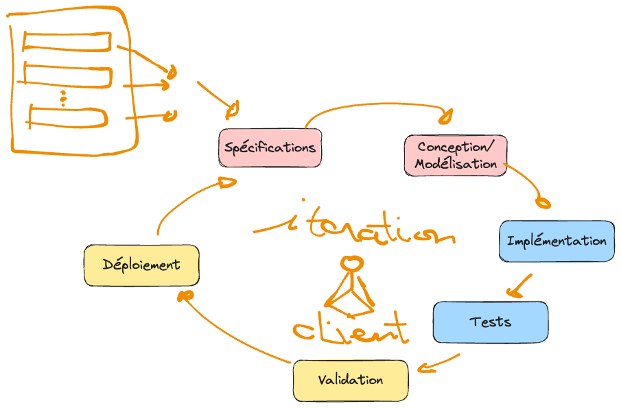
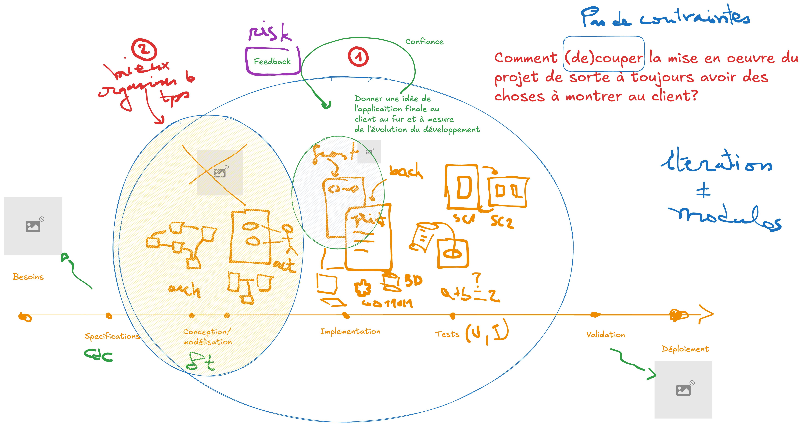
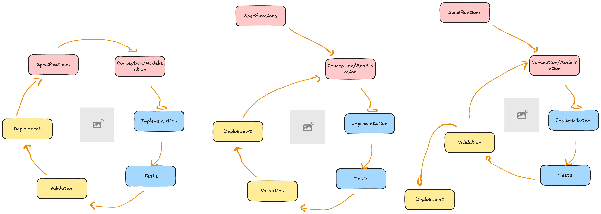

.. _part2_chap6:

***********************************************************************
Chapitre 6 : Le modèle itératif
***********************************************************************

Le modèle **itératif** veut mettre le **client au cœur** du développement, ce qui
change fondamentalement la manière de développer.

Comment ça marche ?
===================

La réalisation de l'outil est subdivisée en plusieurs *chunks* — **itérations**,
prototypes, cycles. Chaque itération est un **équilibre entre le back-end et le
front-end**, dans l'optique de **toujours avoir quelque chose à montrer au
client**.

   Le modèle itératif : on livre par petits incréments montrables au client.

   D'où vient l'itératif : répondre aux limites des approches purement séquentielles.

   Différentes façons de découper en itérations.

Avantages, limites et usages
============================

.. list-table::
   :header-rows: 1
   :widths: 33 34 33

   * - Avantages
     - Limites / Défis
     - Bon pour
   * - On garde le **client dans la boucle** ; méthodologie très sûre
     - Le logiciel peut finir **loin** de là où il a commencé ⇒ « le client vous fait perdre » (changements répétés) ; risque de perdre du temps et de l'argent sur une même itération
     - **Tout projet** (très utilisé) ; projets *découpables* ; modules d'un gros projet
   * -
     - **Défi** : maîtriser les changements et débordements du client ; gérer la logistique
     - Quand garder le client dans la boucle est **critique** (ex. logiciels de gestion, ERP)

Exercice
========

Découpez le préliminaire en **3 itérations**. Pour chacune, indiquez ce que vous
montreriez au client à la fin.
