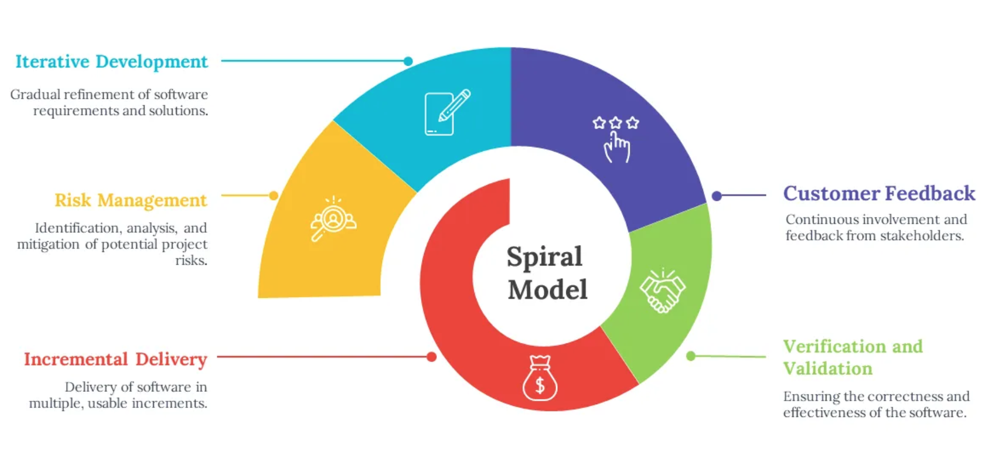
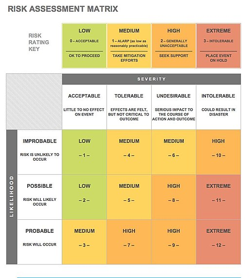

.. _part2_chap7:

***********************************************************************
Chapitre 7 : Le modèle en spirale
***********************************************************************

Le modèle en **spirale** = modèle **itératif** + **gestion des risques**. À chaque
cycle, on évalue les risques avant de poursuivre.

Comment ça marche ?
===================

On répète des cycles combinant développement *et* analyse des risques :
planification → **analyse des risques** → développement → évaluation, puis on
recommence pour le cycle suivant.

   Le modèle en spirale : un modèle itératif piloté par la gestion des risques.

   À chaque tour de spirale, on réévalue les risques et on priorise.

Avantages, limites et usages
============================

.. list-table::
   :header-rows: 1
   :widths: 33 34 33

   * - Avantages
     - Limites / Défis
     - Bon pour
   * - Tous les avantages de l'itératif ; modèle **très sûr** grâce à la gestion des risques
     - Comme l'itératif, le logiciel peut **dériver** ; perte possible de temps/argent sur une itération
     - **Gros projets** à forte sensibilité (hôpital, aéronautique, …)
   * -
     - **Difficile** à mettre en œuvre : l'évaluation des risques est multifactorielle. **Défi** : bien évaluer et **prioriser** les risques + gérer proprement la documentation (coûteuse)
     - Projets à **haut risque**, R&D, projets d'**IA** (à cause de la versatilité des modèles)

Exercice
========

Pour un logiciel critique (ex. gestion hospitalière), identifiez **trois risques**
majeurs et l'ordre dans lequel vous les traiteriez.
