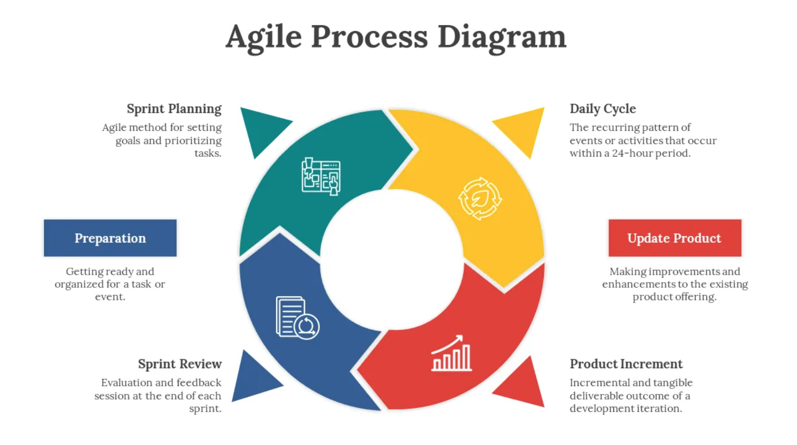
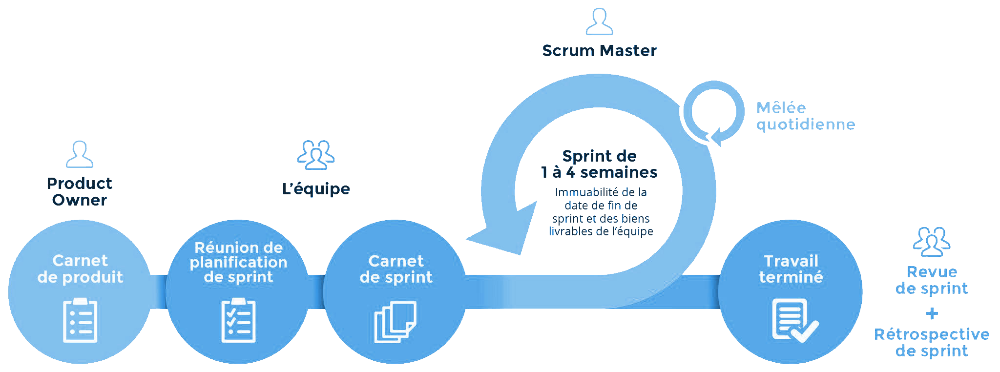

.. _part2_chap8:

***********************************************************************
Chapitre 8 : Agile (Scrum, Kanban)
***********************************************************************

L'**Agile** = modèle **itératif** + **règles agiles**. La philosophie agile place
la **satisfaction du client** au cœur (collaboration, adaptation au changement,
livraisons fréquentes). Deux déclinaisons très répandues : **Scrum** et **Kanban**.

   L'Agile : un cadre itératif gouverné par des règles et des valeurs.

Agile / Scrum
=============

**Scrum = itératif (Agile) + itérations de taille fixe (les *sprints*) + gestion
de projet.** La satisfaction du client est recherchée à tout prix.

   Scrum : des sprints de durée fixe, rythmés par des cérémonies.

.. list-table::
   :header-rows: 1
   :widths: 33 34 33

   * - Avantages
     - Limites / Défis
     - Bon pour
   * - Itérations cadencées et prévisibles ; client réellement impliqué ; gestion de projet intégrée
     - Nécessite une **équipe bien formée** aux cérémonies Agile & Scrum ; risques de **hors-périmètre** et de **hors-délai** ⇒ expliquer la méthode au client en amont et pourquoi/comment l'impliquer ; défis propres à l'itératif
     - Projets de taille **moyenne à grande** ; quand garder le client dans la boucle est **critique** ; projets bien planifiés (livrables + échéances, changements flexibles) ; ERP

Agile / Kanban
==============

**Kanban = itératif (Agile) + gestion d'un *flux continu*** (visuel). On fait
croître le produit graduellement, en visualisant le travail.

.. list-table::
   :header-rows: 1
   :widths: 33 34 33

   * - Avantages
     - Limites / Défis
     - Bon pour
   * - S'adapte à des **specs floues** au départ ; permet une croissance **progressive**
     - Défis de l'itératif ; **devient chaotique sans discipline** ⇒ introduire de petites cérémonies (même non conventionnelles) ; demande un **engagement de long terme**
     - Tout projet aux **specs peu claires** au début ; logiciels d'entreprise en évolution continue, maintenance ; logiciels bureautiques (Word, Excel, …)

Exercice
========

Votre groupe développe le préliminaire en **Scrum**. Proposez un découpage en
2 sprints et listez les cérémonies que vous tiendriez (et avec qui).
